# 🌍 Earth Terrain to Godot - Automated Pipeline

Automatically extract real-world terrain from NASA/USGS elevation data and generate Godot-ready 3D meshes.

## 🏗️ Architecture

```mermaid
graph TD
    A[🌍 Input Coordinates<br/>Lat/Lon + Size] --> B[📡 DEM Download]
    B --> |elevation lib| C[🗺️ NASA SRTM Data<br/>30m resolution]
    C --> D[⚙️ Raster Processing]
    D --> |rasterio| E[Height Map Array]
    E --> |numpy + scipy| F[Resampled Grid<br/>512x512]
    F --> G[🎨 Mesh Generation]
    G --> |bpy API| H[Blender Scene<br/>Vertices + Faces]
    H --> I[📦 GLTF Export]
    I --> |export_scene.gltf| J[godot_terrain.gltf<br/>+ .bin files]
    J --> K[🎮 Godot 4.x Import]
    
    style A fill:#4CAF50,stroke:#2E7D32,color:#fff
    style C fill:#2196F3,stroke:#1565C0,color:#fff
    style F fill:#FF9800,stroke:#E65100,color:#fff
    style H fill:#9C27B0,stroke:#6A1B9A,color:#fff
    style J fill:#F44336,stroke:#C62828,color:#fff
    style K fill:#00BCD4,stroke:#00838F,color:#fff
```



## 📦 Tech Stack

| Component | Purpose | Version |
|-----------|---------|---------|
| **Blender** | 3D mesh generation | 3.6+ |
| **bpy** | Blender Python API | Built-in |
| **elevation** | SRTM DEM downloader | Latest |
| **rasterio** | Geospatial raster I/O | Latest |
| **numpy** | Array processing | Latest |
| **scipy** | Image resampling | Latest |

## 🚀 Installation (0% → 100%)

### Step 1: Install Blender (0% → 30%)

**Linux:**
```bash
sudo apt install blender
```

**macOS:**
```bash
brew install --cask blender
```

**Windows:**
Download from [blender.org](https://www.blender.org/download/)

### Step 2: Install Python Dependencies (30% → 60%)

```bash
# Find Blender's Python
blender --background --python-expr "import sys; print(sys.executable)"

# Install packages (replace with your Blender Python path)
/path/to/blender/python -m pip install elevation rasterio numpy scipy
```

**Alternative:** Use system Python if Blender uses it
```bash
pip install elevation rasterio numpy scipy
```

### Step 3: Download Script (60% → 70%)

```bash
# Save terrain_to_godot.py to your project directory
curl -O https://your-script-location/terrain_to_godot.py
```

### Step 4: Configure Location (70% → 80%)

Edit the `CONFIG` dict in `terrain_to_godot.py`:

```python
CONFIG = {
    'lat': -23.0,        # Latitude (example: Rio beach)
    'lon': -43.2,        # Longitude
    'size_km': 5,        # Area size in kilometers
    'resolution': 512,   # Mesh detail (256, 512, 1024)
    'vertical_scale': 0.01,  # Height multiplier
    'output_path': './godot_terrain.gltf',
    'dem_source': 'SRTM1'  # SRTM1 (30m) or SRTM3 (90m)
}
```

### Step 5: Run Pipeline (80% → 90%)

**Basic usage:**
```bash
blender --background --python terrain_to_godot.py
```

**With custom coordinates:**
```bash
blender --background --python terrain_to_godot.py -- 40.7128 -74.0060
# Generates terrain for New York (lat=40.7, lon=-74.0)
```

### Step 6: Import to Godot (90% → 100%)

1. Open Godot 4.x project
2. Copy `godot_terrain.gltf` and `.bin` files to project folder
3. Drag `.gltf` into scene
4. Add CollisionShape3D with generated mesh
5. Apply materials/textures as needed

## 📍 Example Locations

| Location | Lat | Lon | Type |
|----------|-----|-----|------|
| Copacabana Beach | -22.97 | -43.18 | Beach |
| Pacific Ocean | 0.0 | -140.0 | Ocean |
| Mount Everest | 27.98 | 86.92 | Mountain |
| Grand Canyon | 36.10 | -112.11 | Canyon |
| Great Barrier Reef | -18.28 | 147.69 | Reef |

## ⚙️ Configuration Options

### Resolution

Higher values = more detail but larger files:
- `256`: Low poly, fast (good for distant terrain)
- `512`: Balanced (recommended)
- `1024`: High detail (close-up views)
- `2048`: Very high detail (large files, slow)

### Vertical Scale

Adjust terrain height:
- `0.001`: Very flat (ocean, plains)
- `0.01`: Moderate (default)
- `0.1`: Exaggerated (dramatic mountains)
- `1.0`: True scale (may be too extreme)

### DEM Source

- `SRTM1`: 30m resolution (better detail)
- `SRTM3`: 90m resolution (faster download)

## 🐛 Troubleshooting

**Error: "Module 'elevation' not found"**
- Install in Blender's Python: see Step 2

**Error: "No DEM data available"**
- SRTM only covers -60° to +60° latitude
- Try different coordinates or use ASTER data

**Mesh appears flat**
- Increase `vertical_scale` in CONFIG
- Check if location is actually flat (ocean, plains)

**File too large**
- Reduce `resolution` (try 256 or 128)
- Reduce `size_km` to smaller area

## 📚 Advanced Usage

### Batch Processing Multiple Locations

```python
locations = [
    {'lat': -22.97, 'lon': -43.18, 'name': 'copacabana'},
    {'lat': 27.98, 'lon': 86.92, 'name': 'everest'}
]

for loc in locations:
    CONFIG['lat'] = loc['lat']
    CONFIG['lon'] = loc['lon']
    CONFIG['output_path'] = f"./terrain_{loc['name']}.gltf"
    main()
```

### Custom Mesh Processing

After `create_terrain_mesh()`, add:

```python
# Smooth shading
bpy.ops.object.shade_smooth()

# Decimate mesh (reduce polygons)
bpy.ops.object.modifier_add(type='DECIMATE')
bpy.context.object.modifiers["Decimate"].ratio = 0.5
```